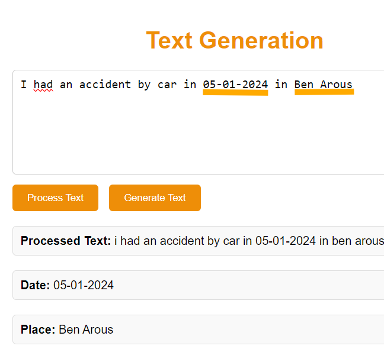
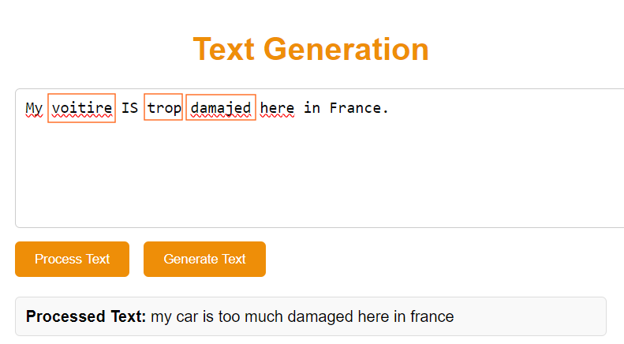
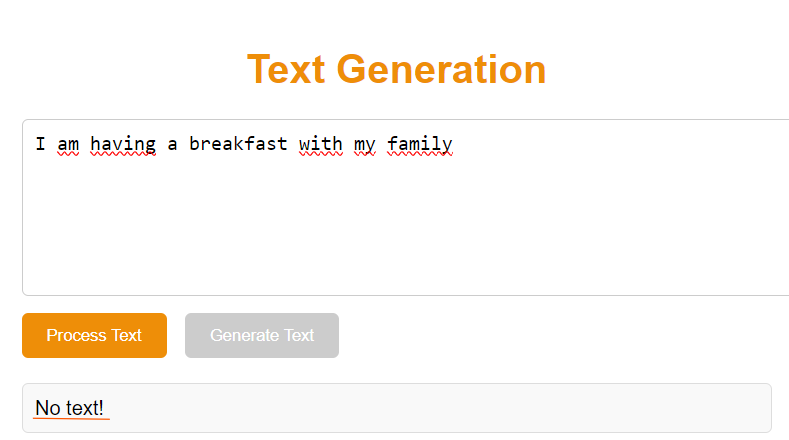
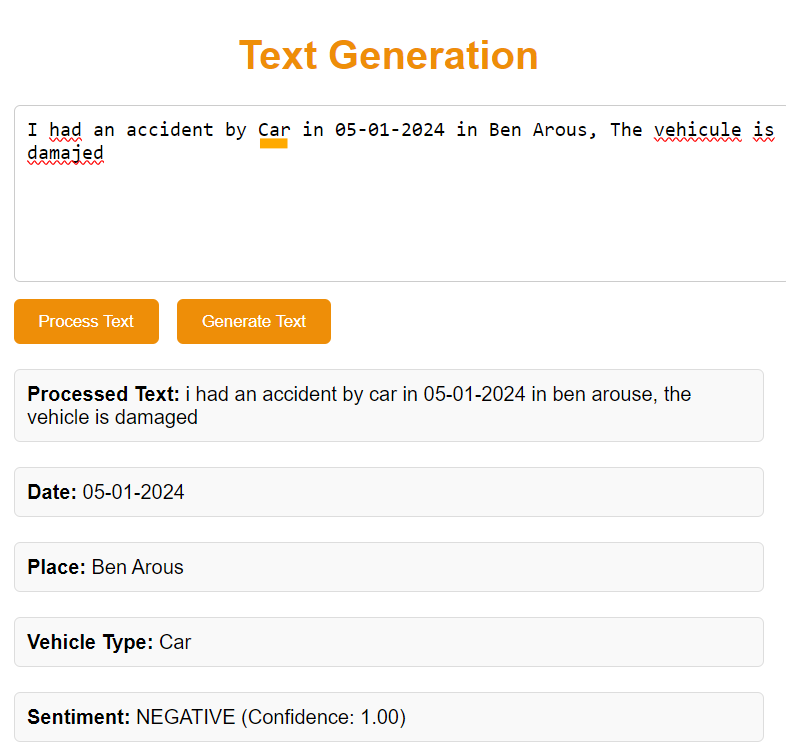
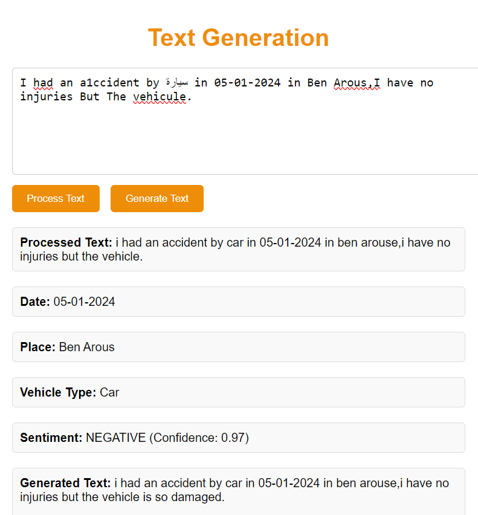

# Text Generation App using NLP and LLM

The project is a text generation application that processes accident descriptions using Natural Language Processing (NLP) and Large Language Model (LLM) techniques.

The text generation application is structured around two main components:
- Text Processing
- Text Generation

The process begins with text processing, where raw text is cleaned and prepared. Then, text generation uses the processed text as a base to produce generated content.

Below is the general architecture of the application development in Visual Studio Code. I divided my code into two main parts:
- **Frontend**: Developed using Flask
- **Backend**: Developed in Python with the following components:
  - Error Correction Stage
  - Information Extraction Stage
  - General Processing Stage
  - Translation Stage
  - Filtering Stage
  - Generation Stage

**Information Extraction Stage**

This first stage involves extracting the date and location of the accident from the description. It is considered the initial step to ensure that these essential pieces of information are not removed during the subsequent text cleaning process.

Date extraction is performed using the regex library, while location extraction is achieved through Named Entity Recognition (NER) in NLP.

**Text Cleaning Stage**

Text cleaning is an essential step in natural language processing. In this project, the cleaning process involves removing URLs, email addresses, arbitrary numbers, HTML tags, and any other unnecessary information. It also includes removing words that are not found in the dictionary, using the BERT model from Hugging Face.

**Text Correction Stage**

For the text correction stage, a function is used to correct typographical errors, as well as grammar and spelling mistakes. This is done using specific tools depending on the language: pyspellchecker for French and TextBlob for English.

**Text Translation Stage**

For the text translation stage, we start by translating individual words from a file named car-accident-translation, which contains a list of French words and their English translations related to accidents. If a word is not found in this file, we use the Google Translate API to translate the individual word into English, as it supports translation between many languages. If the translation via the API is not sufficient for the context, we use the pre-trained MarianMTModel from Hugging Face to provide a more contextual and accurate translation.

**Text Filtering Stage**

The objective of this stage is to remove all irrelevant or out-of-context sentences using a classification model. The model identifies and filters out non-pertinent sentences in the text.

Data Collection and Labeling: Data is collected and labeled for training.

Data Splitting, Preprocessing, and Tokenization: We use DistilBertTokenizerFast pretrained on 'distilbert-base-uncased' to tokenize the texts.

Model Configuration and Fine-Tuning: We configure and fine-tune a classification model, such as DistilBERT, to accurately identify irrelevant content.

**Extraction of Vehicle Type and Sentiments**

The extraction of the vehicle type and sentiment is performed after the text correction and translation to ensure accurate identification of vehicles in English. We provided a file listing all vehicle types in English, allowing for reliable and precise extraction of vehicle-related information from the translated text.

Sentiment Extraction:
For sentiment extraction, we use a pipeline from Hugging Face, pipeline('sentiment-analysis'), which is based on a pretrained model capable of predicting the sentiment of the text.

**The Text Generation Stage**

The text generation stage uses two pretrained generation models to produce texts based on a given prompt. We first load the model using the Hugging Face Transformers library, specifically the "distilbert/distilgpt2" model. Then, we utilize OpenAI's GPT-4 model for further text generation.

