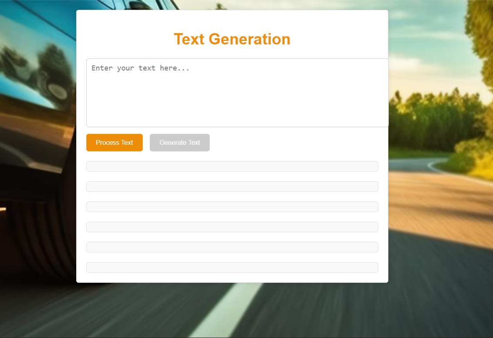

# Text Generation App using NLP and LLM

The project is a text generation application that processes accident descriptions using Natural Language Processing (NLP) and Large Language Model (LLM) techniques.

The text generation application is structured around two main components:
- Text Processing
- Text Generation

The process begins with text processing, where raw text is cleaned and prepared. Then, text generation uses the processed text as a base to produce generated content.

Below is the general architecture of the application development in Visual Studio Code. I divided my code into two main parts:
- **Frontend**: Developed using Flask
- **Backend**: Developed in Python with the following components:
  - Error Correction Stage
  - Information Extraction Stage
  - General Processing Stage
  - Translation Stage
  - Filtering Stage
  - Generation Stage

